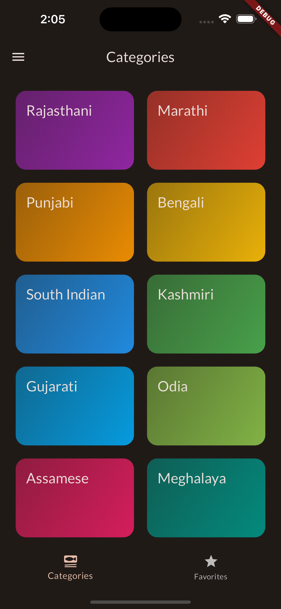
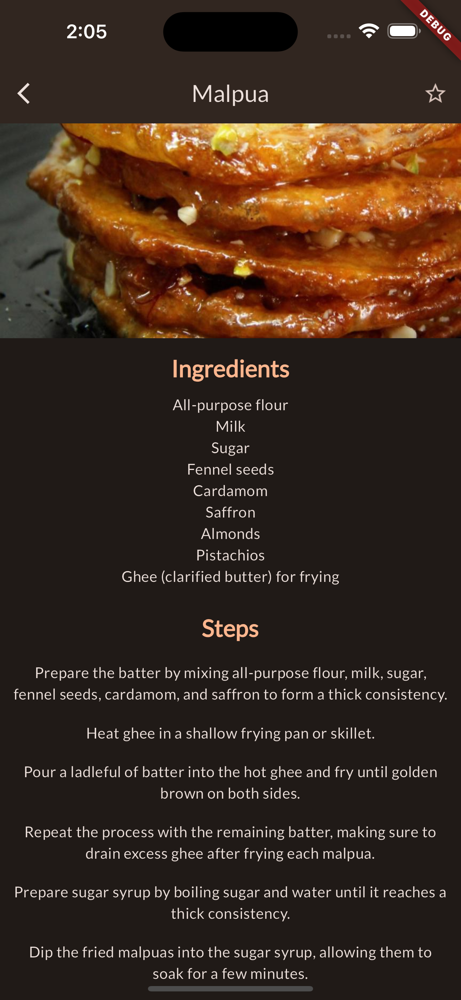
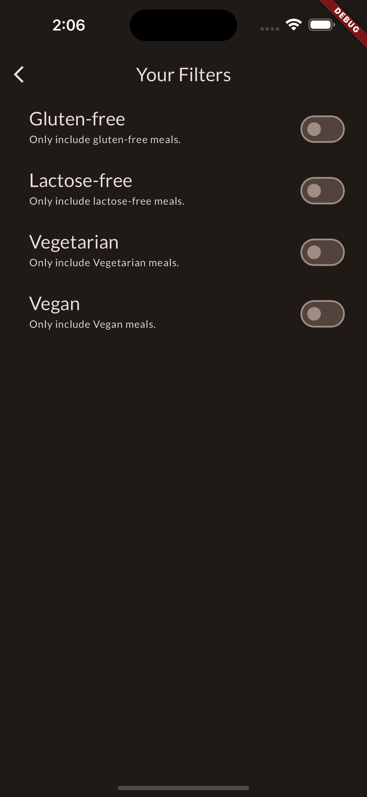

# Meals

An app centered around Indian cuisine, highlighting popular dishes nationwide. It provides detailed recipes, ingredients, and incorporates filter options for users to personalize their culinary exploration based on preferences.

## Getting Started

This project is a starting point for a Flutter application.

1. Download the project in you device.
2. Open the flutter project in IDE.
3. Open terminal type "flutter pub -get".
4. Type "flutter run".
5. Choose device according to you ease.

## SnapShot of an app

  </img>
&nbsp
&nbsp
</img>
&nbsp
&nbsp
</img>
 
&nbsp
&nbsp
&nbsp
&nbsp
&nbsp
&nbsp
&nbsp
&nbsp
&nbsp
</img>
&nbsp
&nbsp
&nbsp
&nbsp
&nbsp
</img>

